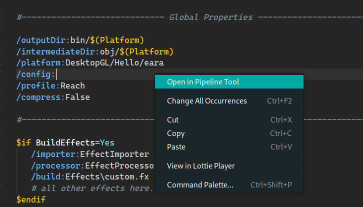

# MonoGame Content Builder

Right click in any .mgcb file to open it in the MonoGame Content Builder editor.



## Prerequisites

Install and set up the MGCB Editor. [If you have dotnet installed][1]:

```sh
dotnet tool install --global dotnet-mgcb-editor
mgcb-editor --register
```

Note: If you are using the older versions of the editor, then you need to update
its path in the project's setting accordingly.

[1]: https://docs.monogame.net/articles/getting_started/1_setting_up_your_development_environment_ubuntu.html#install-mgcb-editor
