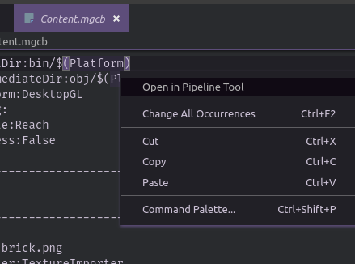

# monogame-pipeline-vscode

Right click in any .mgcb file to open it in the MonoGame pipeline tool.



## Prerequisites

Install Monogame Pipeline .NET tool. You can install it using the following scripts

```
dotnet tool install --global dotnet-mgcb-editor
mgcb-editor --register
```

Source: [Monogame Documentation](https://docs.monogame.net/articles/getting_started/1_setting_up_your_development_environment_ubuntu.html#install-mgcb-editor)

Note: If you are using the older versions of the Monogame pipeline, then you need to update its path in the project's setting accordingly